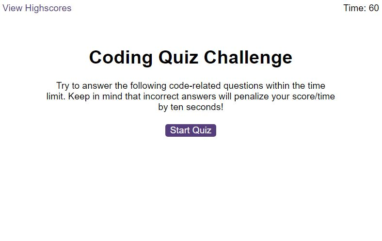
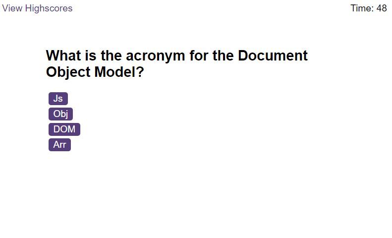
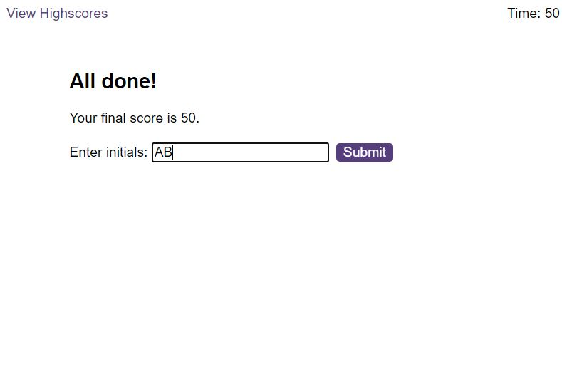
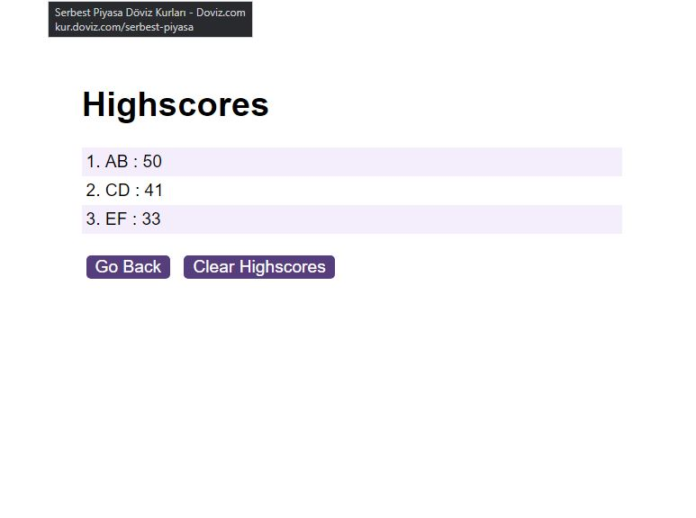
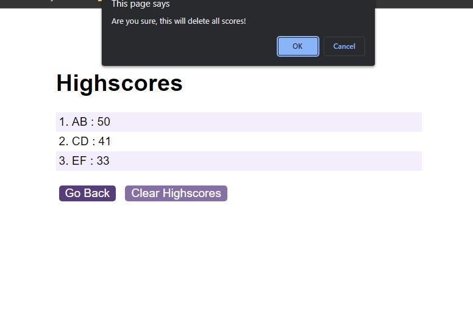

# The-JS-Quiz
An interactive quiz app made using Javascript and browser dom.

## Table of Contents
* [Description](#Description)
* [Installation](#Installation)
* [Usage](#Usage)
* [Credits](#Credits)
* [Licence](#Licence)
* [Features](#Features)
* [Contribute](#Contribute)

## Description

This app will be of great use when you need to test and check the knowledge of students at school or employees at a workplace by a quiz where they race with time clicking the correct answers. They need to watch for the wrong aswers because then they will be penalised by deduction from their score time. 

## Installation
N/A

## Usage

## Credits
Thanks to bootcamp teaching team and w3schools.com for their tutorials

## Licence
This app is distributed under 

## Features
Web application using localStorage to keep scoreboard persistent

## Contribute
N/A

## Tests
N/A

## Questions
Please click this link to go to [Github repo](https://github.com/onderguler35/The-JS-Quiz)
For any questions or comments please [contact me](mailto:onder5@hotmail.com)